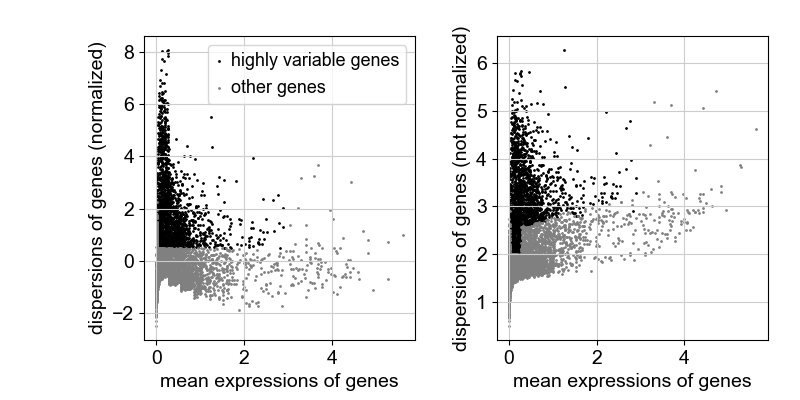

# Scanpy Practice - PBMC Preprocessing & Clustering

### Background:
Coming from 5 years of research experience, I have a growing interest for the field of Bioinformatics. As such I have been exploring personal projects & practices to apply computational methods
to biological data. 

Scanpy is a very powerful tool that I have come across. Within the toolkit's resources, Scanpy provides a tutorial section, which I work through here to not only explore my personal interests, 
but also apply computational methods to real genomics data. I expand on this tutorial by applying knowledge of the Scanpy toolkit via annotations as well as altering certain aspects of the analysis.

### Context:
Scanpy is a Python-based toolkit used for analyzing single-cell gene expression data, and can be used for large-scale data analysis which includes preprocessing, visualizations, clustering, and differential expression testing.
> FEATURES:
> - Preprocessing: Doublet detection to identify and remove cells that result in misclassifications.
> - Visualizations: Plotting functions
> - Clustering: Methods for identifying clusters in the data
> - Trajectory Inference: Methods for inferring trajectories in the data
> - Differential Expression Testing: Methods for identifying differentially expressed genes
> - Simulations: Methods for simulating gene regulatory networks

## Walk-Through:
### Within this tutorial, there is a focus on:
### 1. Preprocessing

### 2. Principal Component Analysis

### 3. Neighbor Graphs
### 4. Clustering
### 5. Marker Gene Identifications

